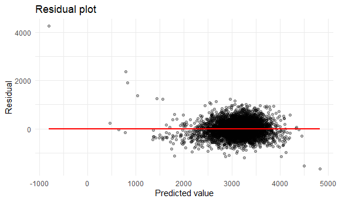
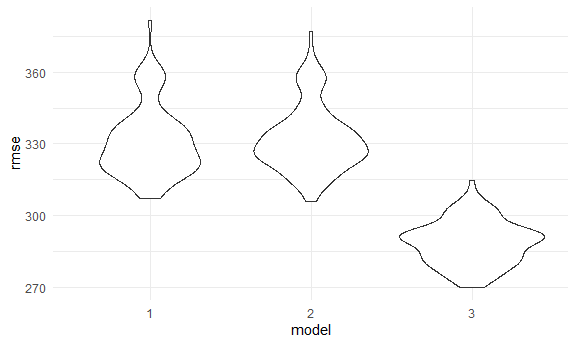
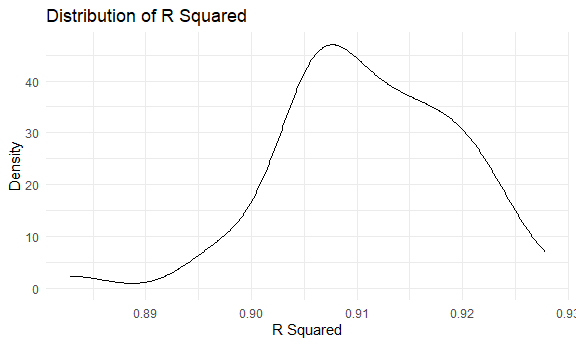
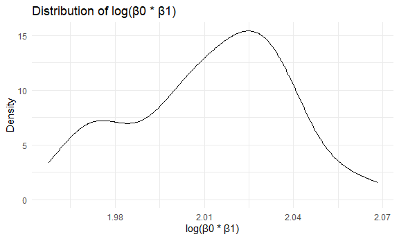

p8105\_hw6\_jz3425
================

## Problem 1

Load the data.

``` r
bwt_df = 
  read_csv("data/birthweight.csv")


# check for missing data
bwt_df[rowSums(is.na(bwt_df)) != 0,]
```

    ## # A tibble: 0 x 20
    ## # ... with 20 variables: babysex <dbl>, bhead <dbl>, blength <dbl>, bwt <dbl>,
    ## #   delwt <dbl>, fincome <dbl>, frace <dbl>, gaweeks <dbl>, malform <dbl>,
    ## #   menarche <dbl>, mheight <dbl>, momage <dbl>, mrace <dbl>, parity <dbl>,
    ## #   pnumlbw <dbl>, pnumsga <dbl>, ppbmi <dbl>, ppwt <dbl>, smoken <dbl>,
    ## #   wtgain <dbl>

``` r
bwt_df %>% 
  filter(pnumsga != 0)
```

    ## # A tibble: 0 x 20
    ## # ... with 20 variables: babysex <dbl>, bhead <dbl>, blength <dbl>, bwt <dbl>,
    ## #   delwt <dbl>, fincome <dbl>, frace <dbl>, gaweeks <dbl>, malform <dbl>,
    ## #   menarche <dbl>, mheight <dbl>, momage <dbl>, mrace <dbl>, parity <dbl>,
    ## #   pnumlbw <dbl>, pnumsga <dbl>, ppbmi <dbl>, ppwt <dbl>, smoken <dbl>,
    ## #   wtgain <dbl>

``` r
bwt_df %>% 
  filter(pnumlbw != 0)
```

    ## # A tibble: 0 x 20
    ## # ... with 20 variables: babysex <dbl>, bhead <dbl>, blength <dbl>, bwt <dbl>,
    ## #   delwt <dbl>, fincome <dbl>, frace <dbl>, gaweeks <dbl>, malform <dbl>,
    ## #   menarche <dbl>, mheight <dbl>, momage <dbl>, mrace <dbl>, parity <dbl>,
    ## #   pnumlbw <dbl>, pnumsga <dbl>, ppbmi <dbl>, ppwt <dbl>, smoken <dbl>,
    ## #   wtgain <dbl>

The result shows that there is no missing data, and all `psumsga` and
`pnumlbw` = 0 so we could neglect these two variables.

Clean the data for regression analysis.

``` r
bwt_df =
  bwt_df %>% 
  select(-pnumsga, -pnumlbw) %>% 
  mutate(
    babysex = recode_factor(babysex, `1` = "male", `2` = "female"),
    frace = recode_factor(frace, `1` = "white", `2` = "black", `3` = "asian", `4` = "puerto_rican", `8` = "other", `9` = "unknown"),
    malform = factor(malform),
    mrace = recode_factor(mrace, `1` = "white", `2` = "black", `3` = "asian", `4` = "puerto_rican", `8` = "other")
  ) %>% 
  relocate(bwt)

#have a look
head(bwt_df)
```

    ## # A tibble: 6 x 18
    ##     bwt babysex bhead blength delwt fincome frace gaweeks malform menarche
    ##   <dbl> <fct>   <dbl>   <dbl> <dbl>   <dbl> <fct>   <dbl> <fct>      <dbl>
    ## 1  3629 female     34      51   177      35 white    39.9 0             13
    ## 2  3062 male       34      48   156      65 black    25.9 0             14
    ## 3  3345 female     36      50   148      85 white    39.9 0             12
    ## 4  3062 male       34      52   157      55 white    40   0             14
    ## 5  3374 female     34      52   156       5 white    41.6 0             13
    ## 6  3374 male       33      52   129      55 white    40.7 0             12
    ## # ... with 8 more variables: mheight <dbl>, momage <dbl>, mrace <fct>,
    ## #   parity <dbl>, ppbmi <dbl>, ppwt <dbl>, smoken <dbl>, wtgain <dbl>

### Marginal distribution

First let’s see the marginal distribution of each variable.

``` r
lm_function = function(x) {
  
  lm(bwt_df$bwt ~ x, data = bwt_df) %>% 
    broom::tidy() 
  
}

marginal = 
  bwt_df %>% 
  select(-bwt) %>% 
  map(lm_function)

#have a look at some of the results
marginal[1:5]
```

    ## $babysex
    ## # A tibble: 2 x 5
    ##   term        estimate std.error statistic      p.value
    ##   <chr>          <dbl>     <dbl>     <dbl>        <dbl>
    ## 1 (Intercept)   3158.       10.8    292.   0           
    ## 2 xfemale        -88.8      15.5     -5.73 0.0000000108
    ## 
    ## $bhead
    ## # A tibble: 2 x 5
    ##   term        estimate std.error statistic p.value
    ##   <chr>          <dbl>     <dbl>     <dbl>   <dbl>
    ## 1 (Intercept)   -4831.    107.       -45.0       0
    ## 2 x               236.      3.19      74.0       0
    ## 
    ## $blength
    ## # A tibble: 2 x 5
    ##   term        estimate std.error statistic   p.value
    ##   <chr>          <dbl>     <dbl>     <dbl>     <dbl>
    ## 1 (Intercept)   -3841.     95.1      -40.4 5.44e-303
    ## 2 x               140.      1.91      73.2 0        
    ## 
    ## $delwt
    ## # A tibble: 2 x 5
    ##   term        estimate std.error statistic  p.value
    ##   <chr>          <dbl>     <dbl>     <dbl>    <dbl>
    ## 1 (Intercept)  2148.      49.4        43.5 0       
    ## 2 x               6.64     0.335      19.8 1.22e-83
    ## 
    ## $fincome
    ## # A tibble: 2 x 5
    ##   term        estimate std.error statistic  p.value
    ##   <chr>          <dbl>     <dbl>     <dbl>    <dbl>
    ## 1 (Intercept)  2980.      15.1       197.  0       
    ## 2 x               3.05     0.296      10.3 1.26e-24

…

According to the p-values, some of the variables have strong association
with birthweight while others do not.

First I will choose `bhead`, `blength`, `delwt`, `fincome`, `gaweeks`,
`mheight`, `momage`, `ppbmi`, `ppwt`, `smoken` and `wtgain` for further
tests.

### Testing for pairwise relationship

Among chosen variables, it seems that some of them may have strong
linear associasions. Here are some of apparent ones that I find.

``` r
bwt_df %>% 
  lm(blength ~ bhead, data = .) %>% 
  broom::tidy()
```

    ## # A tibble: 2 x 5
    ##   term        estimate std.error statistic  p.value
    ##   <chr>          <dbl>     <dbl>     <dbl>    <dbl>
    ## 1 (Intercept)    14.1     0.667       21.1 1.93e-94
    ## 2 bhead           1.06    0.0198      53.5 0

``` r
bwt_df %>% 
  lm(blength ~ gaweeks, data = .) %>% 
  broom::tidy()
```

    ## # A tibble: 2 x 5
    ##   term        estimate std.error statistic   p.value
    ##   <chr>          <dbl>     <dbl>     <dbl>     <dbl>
    ## 1 (Intercept)   37.5      0.484       77.6 0        
    ## 2 gaweeks        0.310    0.0122      25.4 1.95e-132

I will delete `gaweeks` and `bhead` and keep `blength`.

``` r
bwt_df %>% 
  lm(delwt ~ mheight, data = .) %>% 
  broom::tidy()
```

    ## # A tibble: 2 x 5
    ##   term        estimate std.error statistic   p.value
    ##   <chr>          <dbl>     <dbl>     <dbl>     <dbl>
    ## 1 (Intercept)   -72.7      7.35      -9.89 7.75e- 23
    ## 2 mheight         3.44     0.116     29.7  7.11e-177

``` r
bwt_df %>% 
  lm(delwt ~ ppwt, data = .) %>% 
  broom::tidy()
```

    ## # A tibble: 2 x 5
    ##   term        estimate std.error statistic   p.value
    ##   <chr>          <dbl>     <dbl>     <dbl>     <dbl>
    ## 1 (Intercept)   27.1     1.03         26.4 3.33e-142
    ## 2 ppwt           0.959   0.00822     117.  0

``` r
bwt_df %>% 
  lm(delwt ~ ppbmi, data = .) %>% 
  broom::tidy()
```

    ## # A tibble: 2 x 5
    ##   term        estimate std.error statistic   p.value
    ##   <chr>          <dbl>     <dbl>     <dbl>     <dbl>
    ## 1 (Intercept)    37.1     1.60        23.2 4.73e-112
    ## 2 ppbmi           5.03    0.0735      68.4 0

``` r
bwt_df %>% 
  lm(delwt ~ wtgain, data = .) %>% 
  broom::tidy()
```

    ## # A tibble: 2 x 5
    ##   term        estimate std.error statistic   p.value
    ##   <chr>          <dbl>     <dbl>     <dbl>     <dbl>
    ## 1 (Intercept)  127.       0.687      184.  0        
    ## 2 wtgain         0.862    0.0279      30.9 8.30e-190

I will delete `mheight`, `ppwt`, `ppbmi`, `wtgain` and keep `delwt`.

So my hypothesis is that a child’s birthweight is associated with baby’s
length at birth, mother’s weight at delivery, mother’s age at delivery,
family monthly income, and average number of cigarettes smoked per day
during pregnancy.

### Build the model

``` r
lm_1 = 
  lm(bwt ~ blength + delwt + fincome + smoken + momage, data = bwt_df)

lm_1 %>% broom::tidy()
```

    ## # A tibble: 6 x 5
    ##   term        estimate std.error statistic  p.value
    ##   <chr>          <dbl>     <dbl>     <dbl>    <dbl>
    ## 1 (Intercept) -4051.      95.2      -42.5  0       
    ## 2 blength       132.       1.92      68.9  0       
    ## 3 delwt           2.83     0.234     12.1  3.30e-33
    ## 4 fincome         1.64     0.206      7.99 1.71e-15
    ## 5 smoken         -3.15     0.687     -4.59 4.62e- 6
    ## 6 momage          6.19     1.38       4.49 7.36e- 6

Show a plot of model residuals against fitted values:

``` r
bwt_df %>% 
  add_residuals(lm_1) %>% 
  add_predictions(lm_1) %>% 
  ggplot(aes(x = pred, y = resid)) +
  geom_point(alpha = .3) +
  geom_smooth(method = "lm", se = FALSE, color = "red") +
  labs(
    title = "Residual plot",
    x = "Predicted value",
    y = "Residual"
  )
```



As expected, the residual values bounce around 0 (the expected value is
about 0).

There is an outlier far away.

``` r
#check the outlier
bwt_df %>% 
  add_residuals(lm_1) %>% 
  add_predictions(lm_1) %>% 
  filter(resid > 4000)
```

    ## # A tibble: 1 x 20
    ##     bwt babysex bhead blength delwt fincome frace gaweeks malform menarche
    ##   <dbl> <fct>   <dbl>   <dbl> <dbl>   <dbl> <fct>   <dbl> <fct>      <dbl>
    ## 1  3459 male       35      20   152      25 white    38.7 0             10
    ## # ... with 10 more variables: mheight <dbl>, momage <dbl>, mrace <fct>,
    ## #   parity <dbl>, ppbmi <dbl>, ppwt <dbl>, smoken <dbl>, wtgain <dbl>,
    ## #   resid <dbl>, pred <dbl>

For this baby, the blength 20 is extremely lower than other observations
while the bhead is normal. It looks like a mistake, and it should be
checked if possible.

## Compare my model to two others

``` r
cv_df =
  crossv_mc(bwt_df, 100) %>% 
  mutate(
    lm_1 = map(train, ~lm(bwt ~ blength + delwt + fincome + smoken + momage, data = .x)),
    lm_2 = map(train, ~lm(bwt ~ blength + gaweeks, data = .x)),
    lm_3 = map(train, ~lm(
      bwt ~ bhead + blength + babysex + 
          bhead * blength + blength * babysex + bhead * babysex +
          bhead * blength * babysex, 
    data = .x
    ))
  ) %>% 
  mutate(
    rmse_1 = map2_dbl(lm_1, test, ~rmse(model = .x, data = .y)),
    rmse_2 = map2_dbl(lm_2, test, ~rmse(model = .x, data = .y)),
    rmse_3 = map2_dbl(lm_3, test, ~rmse(model = .x, data = .y))
  )

cv_df
```

    ## # A tibble: 100 x 9
    ##    train                   test     .id   lm_1  lm_2  lm_3  rmse_1 rmse_2 rmse_3
    ##    <list>                  <list>   <chr> <lis> <lis> <lis>  <dbl>  <dbl>  <dbl>
    ##  1 <resample [3,473 x 18]> <resamp~ 001   <lm>  <lm>  <lm>    330.   336.   286.
    ##  2 <resample [3,473 x 18]> <resamp~ 002   <lm>  <lm>  <lm>    332.   333.   286.
    ##  3 <resample [3,473 x 18]> <resamp~ 003   <lm>  <lm>  <lm>    361.   362.   301.
    ##  4 <resample [3,473 x 18]> <resamp~ 004   <lm>  <lm>  <lm>    319.   316.   275.
    ##  5 <resample [3,473 x 18]> <resamp~ 005   <lm>  <lm>  <lm>    320.   324.   283.
    ##  6 <resample [3,473 x 18]> <resamp~ 006   <lm>  <lm>  <lm>    335.   339.   295.
    ##  7 <resample [3,473 x 18]> <resamp~ 007   <lm>  <lm>  <lm>    324.   324.   281.
    ##  8 <resample [3,473 x 18]> <resamp~ 008   <lm>  <lm>  <lm>    325.   336.   296.
    ##  9 <resample [3,473 x 18]> <resamp~ 009   <lm>  <lm>  <lm>    312.   315.   275.
    ## 10 <resample [3,473 x 18]> <resamp~ 010   <lm>  <lm>  <lm>    320.   331.   284.
    ## # ... with 90 more rows

``` r
cv_df %>% 
  select(rmse_1:rmse_3) %>% 
  pivot_longer(
    rmse_1:rmse_3,
    names_to = "model",
    values_to = "rmse",
    names_prefix = "rmse_"
  ) %>% 
  ggplot(aes(x = model, y = rmse)) +
  geom_violin()
```



My model gets pretty much the same rmse as model 2, but much higher than
model 3. Maybe this shows that there are interactions between blength,
bhead and babysex.

# Problem 2

``` r
weather_df = 
  rnoaa::meteo_pull_monitors(
    c("USW00094728"),
    var = c("PRCP", "TMIN", "TMAX"), 
    date_min = "2017-01-01",
    date_max = "2017-12-31") %>%
  mutate(
    name = recode(id, USW00094728 = "CentralPark_NY"),
    tmin = tmin / 10,
    tmax = tmax / 10) %>%
  select(name, id, everything())
```

    ## Registered S3 method overwritten by 'hoardr':
    ##   method           from
    ##   print.cache_info httr

    ## using cached file: C:\Users\zjb_v\AppData\Local/Cache/R/noaa_ghcnd/USW00094728.dly

    ## date created (size, mb): 2021-09-10 12:36:05 (7.614)

    ## file min/max dates: 1869-01-01 / 2021-09-30

``` r
boot_sample = function(df){
  sample_frac(df, replace = TRUE)
}
```

Bootstrap

``` r
set.seed(518)

boot_straps =
  data_frame(
    strap_number = 1:50,
    strap_sample = rerun(50, boot_sample(weather_df))
  )
```

    ## Warning: `data_frame()` was deprecated in tibble 1.1.0.
    ## Please use `tibble()` instead.
    ## This warning is displayed once every 8 hours.
    ## Call `lifecycle::last_lifecycle_warnings()` to see where this warning was generated.

``` r
bootstrap_results = 
  boot_straps %>% 
  mutate(
    models = map(strap_sample, ~lm(tmax ~ tmin, data = .x)),
    results_1 = map(models, broom::glance),
    results_2 = map(models, broom::tidy)
  ) %>% 
  select(strap_number, results_1, results_2) %>% 
  unnest(results_1, results_2) %>% 
  select(strap_number, r.squared, term, estimate) %>% 
  janitor::clean_names()
```

    ## Warning: unnest() has a new interface. See ?unnest for details.
    ## Try `df %>% unnest(c(results_1, results_2))`, with `mutate()` if needed

    ## Warning in FUN(X[[i]], ...): strings not representable in native encoding will
    ## be translated to UTF-8

    ## Warning in FUN(X[[i]], ...): unable to translate '<U+00C4>' to native encoding

    ## Warning in FUN(X[[i]], ...): unable to translate '<U+00D6>' to native encoding

    ## Warning in FUN(X[[i]], ...): unable to translate '<U+00E4>' to native encoding

    ## Warning in FUN(X[[i]], ...): unable to translate '<U+00F6>' to native encoding

    ## Warning in FUN(X[[i]], ...): unable to translate '<U+00DF>' to native encoding

    ## Warning in FUN(X[[i]], ...): unable to translate '<U+00C6>' to native encoding

    ## Warning in FUN(X[[i]], ...): unable to translate '<U+00E6>' to native encoding

    ## Warning in FUN(X[[i]], ...): unable to translate '<U+00D8>' to native encoding

    ## Warning in FUN(X[[i]], ...): unable to translate '<U+00F8>' to native encoding

    ## Warning in FUN(X[[i]], ...): unable to translate '<U+00C5>' to native encoding

    ## Warning in FUN(X[[i]], ...): unable to translate '<U+00E5>' to native encoding

Plot

``` r
bootstrap_results %>% 
  filter(term == "tmin") %>% 
  ggplot(aes(x = r_squared)) +
  geom_density() +
  labs(
    title = "Distribution of R Squared",
    x = "R Squared",
    y = "Density"
  )
```



``` r
b0 =
  bootstrap_results %>% 
  filter(term == "(Intercept)") %>% 
  pull(estimate)

b1 = 
  bootstrap_results %>% 
  filter(term == "tmin") %>% 
  pull(estimate)

tibble(b0, b1) %>% 
  ggplot(aes(x = log(b0 * b1))) +
  geom_density() +
  labs(
    title = "Distribution of log(β0 * β1)",
    x = "log(β0 * β1)",
    y = "Density"
  )
```



Compute CI

``` r
bootstrap_results %>% 
  filter(term == "tmin") %>% 
  summarize(
    ci_lower = quantile(r_squared, 0.025),
    ci_upper = quantile(r_squared, 0.975)
  )
```

    ## # A tibble: 1 x 2
    ##   ci_lower ci_upper
    ##      <dbl>    <dbl>
    ## 1    0.896    0.923

``` r
tibble(b0, b1) %>% 
  summarize(
    ci_lower = quantile(log(b0 * b1), 0.025),
    ci_upper = quantile(log(b0 * b1), 0.975)
  )
```

    ## # A tibble: 1 x 2
    ##   ci_lower ci_upper
    ##      <dbl>    <dbl>
    ## 1     1.97     2.06
